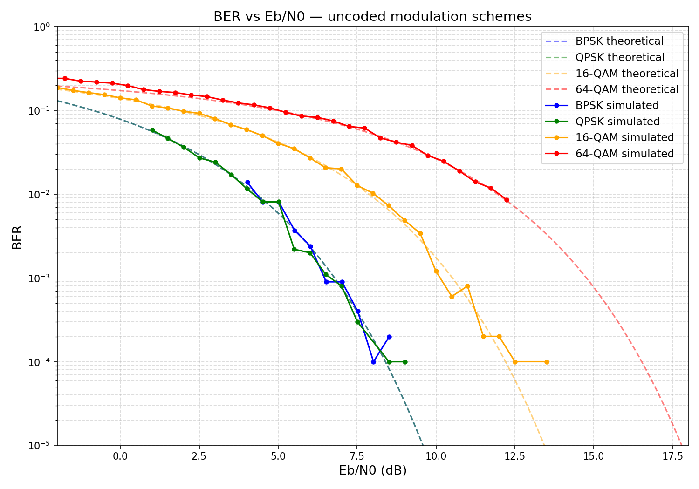
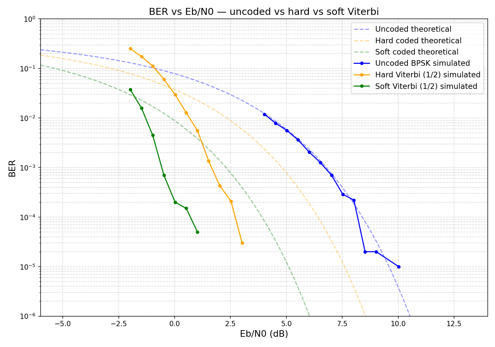
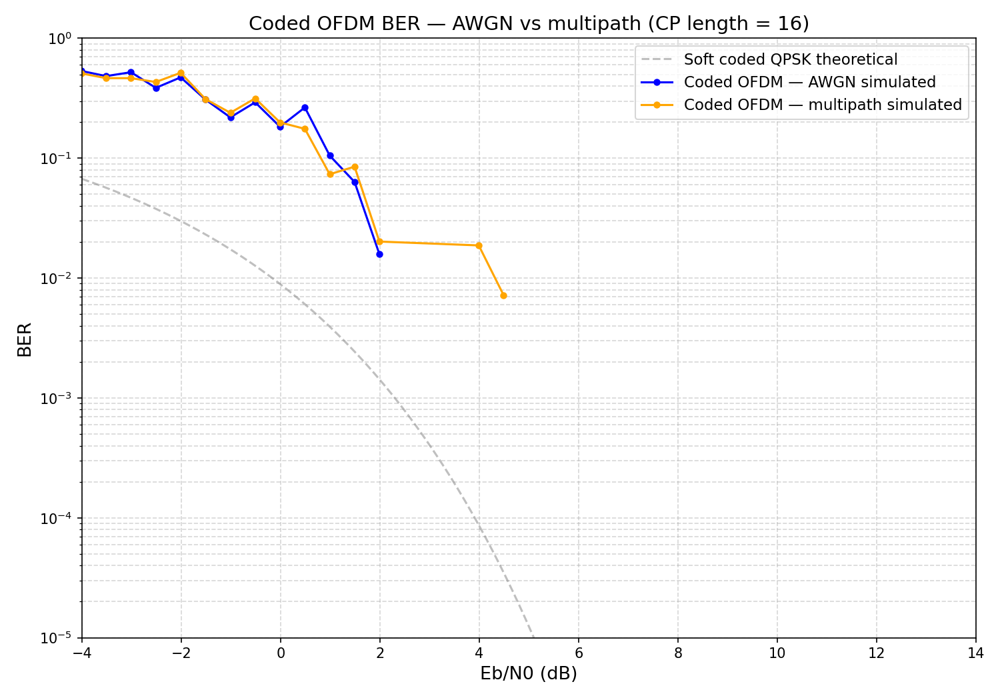

# Modulation Toolkit

The spectrum analyzer showed what was in the air. This project answers what it means.

A persistent carrier at 915 MHz is just a spike on a waterfall but now we can actually control where those waterfall spikes go and the information that they communicate. This project builds that machinery from scratch: a full digital communications stack in C++17 on the same BladeRF 2.0 Micro xA4, going from raw bits to RF and back. The same chain inside every LTE base station, every satellite downlink, every tactical datalink.

---

## Results

**BER vs Eb/N0 — BPSK, QPSK, 16-QAM, 64-QAM tracking theoretical Q-function curves**


**Viterbi coding gain — uncoded vs hard vs soft decision, rate 1/2 and 1/3**
Soft Viterbi hits 1e-4 BER at -2.5 dB Eb/N0. Uncoded BPSK needs 8.5 dB for the same. 11 dB of coding gain demonstrated end to end.


**Coded OFDM — AWGN vs multipath**
Two-tap multipath channel (direct path + 30% reflection at 4-sample delay). Both curves reach zero BER at 5.5 dB — the cyclic prefix absorbs the delay spread exactly, and the LS channel estimator corrects the per-subcarrier distortion.


---

## What It Does

Eight phases from first principles to hardware:

| Phase | What was built |
|-------|----------------|
| 1 | BPSK modulator/demodulator with RRC pulse shaping, BER validation against Q(√2·SNR) |
| 2 | QPSK, 16-QAM, 64-QAM with Gray coding and Mueller-Müller timing recovery PLL |
| 3 | Rate 1/2 K=7 convolutional encoder + soft/hard Viterbi decoder, validated against liquid-dsp |
| 4 | Block interleaver, rate 1/3 FEC, full coded BER analysis — 11 dB coding gain |
| 5 | OFDM modulator/demodulator — IFFT/FFT via FFTW3, cyclic prefix, LTE-style pilot grid, LS channel estimation, one-tap equalizer, multipath validation |
| 6 | BladeRF hardware streaming — threaded TX/RX at 40 MSPS, RF cable loopback, 14 dB confirmed SNR |
| 7 | C-V2X PC5 sidelink demo — SCI format 1, BSM encode/decode over coded OFDM, all fields verified |
| 8 | Publication figures, README |

---

## C-V2X Demo

```
  ╔══════════════════════════════════════════════════════╗
  ║           C-V2X PC5 SIDELINK DEMO                   ║
  ╚══════════════════════════════════════════════════════╝

  TRANSMIT
  Vehicle ID     0xDEADBEEF
  Latitude       38.897700° N
  Longitude      77.036500° W
  Speed          14.99 mph
  Heading        90.00° (East)
  Brakes         Not engaged
  SCI            priority=3  mcs=5  dst=0xFF

  CHANNEL
  FEC            rate 1/2 K=7 → 284 coded bits
  Mapping        QPSK over OFDM (64 subcarriers, CP=16)
  Channel        AWGN 6.0 dB SNR

  RECEIVE
  Vehicle ID     0xDEADBEEF
  Latitude       38.897700° N
  Longitude      77.036500° W
  Speed          14.99 mph
  Heading        90.00° (East)
  Brakes         Not engaged

  VERIFICATION
  Vehicle ID     ✓  PASS
  Latitude       ✓  PASS
  Longitude      ✓  PASS
  Speed          ✓  PASS
  Heading        ✓  PASS

    ALL FIELDS DECODED CORRECTLY
```

BSM serialized → rate 1/2 FEC encoded → QPSK mapped → OFDM modulated →
AWGN channel → OFDM demodulated → Viterbi decoded → BSM deserialized.
---

## Key Numbers

| Metric | Value |
|--------|-------|
| Coding gain (soft 1/3 vs uncoded) | ~11 dB |
| Soft vs hard Viterbi gain | ~2.5 dB |
| Rate 1/3 vs rate 1/2 gain | ~2 dB |
| OFDM SNR at zero BER | 5.5 dB Eb/N0 |
| Multipath penalty vs AWGN | 0 dB (CP absorbs delay spread) |
| BladeRF confirmed cable SNR | 14 dB above noise floor |
| C-V2X BSM decode SNR | 6 dB |
| Sample rate | 40 MSPS |

---

## Hardware

| Component | Detail |
|-----------|--------|
| SDR | Nuand BladeRF 2.0 Micro xA4 |
| RFIC | Analog Devices AD9361 |
| Frequency range | 50 MHz – 6 GHz |
| Sample rate | 40 MSPS |
| Interface | USB 3.0 SuperSpeed |
| Firmware | v2.6.0 |
| FPGA | v0.15.3 hostedxA4 |

---

## Dependencies

```bash
sudo apt install libbladerf-dev libfftw3-dev libliquid-dev libsoapysdr-dev

# Python plots
pip install numpy matplotlib scipy
```

---

## Build

```bash
mkdir build && cd build
cmake .. -DCMAKE_BUILD_TYPE=Release
make -j$(nproc)
```

Debug with sanitizers:
```bash
cmake .. -DCMAKE_BUILD_TYPE=Debug -DSANITIZE=address
cmake .. -DCMAKE_BUILD_TYPE=Debug -DSANITIZE=thread
```

---

## Run

```bash
# software simulation — BER sweeps + C-V2X demo
./modulation_toolkit

# software validation — encoder, Viterbi, OFDM noiseless loopback
./encoder_validation

# hardware loopback — requires BladeRF with RF cable TX1→RX1
./bladerf_loopback
```

FPGA must be loaded before hardware tests:
```bash
bladeRF-cli -l /usr/share/Nuand/bladeRF/hostedxA4.rbf
```

---

## Python Plots

```bash
cd python

# BER curves — all baseband schemes vs theoretical
python3 ber_curves_plot.py

# Viterbi coding gain — rate 1/2 and 1/3, hard and soft
python3 viterbi_soft_hard_plot.py

# Coded OFDM — AWGN vs multipath
python3 ofdm_multipath_plot.py
```

---


## Tools and Libraries

| Tool | Purpose |
|------|---------|
| libbladeRF 2.5.0 | BladeRF 2.0 Micro hardware abstraction |
| liquid-dsp | Reference encoder for validation |
| FFTW3 (float) | IFFT/FFT for OFDM |
| SoapySDR | SDR hardware abstraction layer |
| NumPy / SciPy / Matplotlib | BER plots and theoretical curves |

---

## References

- Proakis, J.G. (2001). *Digital Communications*, 4th ed. McGraw-Hill.
- 3GPP TS 36.212 — Sidelink control information, PC5 interface
- SAE J2735 — Dedicated Short Range Communications message set
- [Nuand BladeRF 2.0 Micro Documentation](https://www.nuand.com/bladeRF-2.0-micro/)
- [libbladeRF API Reference](https://www.nuand.com/libbladeRF-doc/)
- Viterbi, A.J. (1967). "Error bounds for convolutional codes." *IEEE Transactions on Information Theory.*
- Welch, P.D. (1967). "The use of fast Fourier transform for the estimation of power spectra." *IEEE Transactions on Audio and Electroacoustics.*

---

## Related

- [spectrum_analyzer](https://github.com/timodagoat/spectrum_analyzer) — the project that started this. Passive RF observation at 40 MSPS on the same hardware. Built to understand what was in the air. This project builds what puts meaning into it.


---

## Documentation

- [Architecture](ARCHITECTURE.md) — design decisions, tradeoffs, and implementation notes for each subsystem
